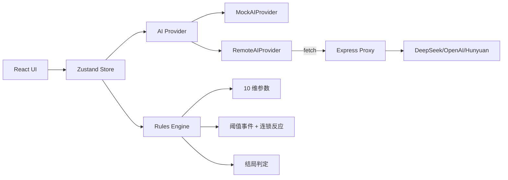

# 《汉使》Han Envoy — 长期可复用资产导向 · 项目体检报告

> 体检日期：2026-05-26
> 体检对象：`E:/yy_project/han-envoy`（git 仓库，main 分支）
> 体检者视角：游戏制作人 / AI Agent 系统架构师 / 代码审查专家
> 报告基调：**保护已有成果，识别真正瓶颈，输出可复用材料。**
> 文档版本：v1.0（首次产出，可由后续 Agent 持续追加补丁章节）

---

## 0. 目录

1. [项目现状摘要](#1-项目现状摘要)
2. [当前项目最值得保留的资产](#2-当前项目最值得保留的资产)
3. [当前架构审查](#3-当前架构审查)
4. [核心玩法闭环审查](#4-核心玩法闭环审查)
5. [AI / LLM 使用方式审查](#5-ai--llm-使用方式审查)
6. [NPC 记忆与状态系统审查](#6-npc-记忆与状态系统审查)
7. [规则引擎与数值结算审查](#7-规则引擎与数值结算审查)
8. [技术债与风险清单](#8-技术债与风险清单)
9. [长期可维护性改进路线图](#9-长期可维护性改进路线图)
10. [后续开发 Phase 规划](#10-后续开发-phase-规划)
11. [可复制给本地 Coding Agent 的执行提示词](#11-可复制给本地-coding-agent-的执行提示词)
12. [作品集 / Demo / README / 简历包装建议](#12-作品集--demo--readme--简历包装建议)
13. [当前最小下一步](#13-当前最小下一步)
14. [后续 Agent 接手说明](#14-后续-agent-接手说明)

---

## 1. 项目现状摘要

### 1.1 已经实现的内容（按完成度）

| 维度 | 状态 | 实证 |
|---|---|---|
| 工程骨架（Vite + React 18 + TS + Tailwind + Zustand） | **已具备** | `package.json`、`vite.config.ts`、`tsconfig.json` 完整 |
| 10 维外交参数系统（数值结算 + clamp 0–100） | **已具备** | `src/game/initialState.ts`、`src/game/simpleRules.ts`、`src/utils/clamp.ts` |
| 4 个朝堂场景 + 17 个预设选项 | **已具备** | `src/game/scenes.ts` |
| 5 个结局 + 动态补充段落 + 史官评语 | **已具备** | `src/game/endings.ts` |
| 5 个角色（汉使/楼兰王/亲匈/亲汉/译者） | **已具备** | `src/game/characters.ts` |
| 6 组阈值事件 + 6 组连锁反应 | **已具备** | `src/game/thresholdEvents.ts`、`src/game/chainReactions.ts` |
| 动态叙事变体（5 段/场景） | **已具备** | `NARRATIVE_VARIANTS_BY_SCENE` in `scenes.ts` |
| 条件选项（4 个高风险动作有 `condition`） | **已具备** | `canAssassinate`、`canDemandHostage` 等 |
| AI Provider 抽象（presetOnly/mock/realAI） | **已具备** | `src/ai/aiMode.ts`、`src/ai/aiProviderFactory.ts` |
| Mock AI Provider（关键词评分 + 否定/条件威胁/主语检测） | **已具备** | `src/ai/mockAiProvider.ts`（约 470 行） |
| Remote AI Provider（前端→代理调用 + fallback） | **已具备** | `src/ai/remoteAiProvider.ts` |
| 本地 Express AI 代理（OpenAI-compatible，DeepSeek 默认） | **已具备** | `server/aiProxyServer.ts`、`server/aiClient.ts` |
| 服务端 schema sanitize（防 AI 乱写） | **已具备** | `server/schemas.ts` |
| 自由输入 → 分析 → 效果 → 角色反应的完整链路 | **部分具备** | `gameStore.makeFreeInput` 已串通，但场景推进逻辑薄弱 |
| Mock AI 测试样例（28 条意图识别用例） | **部分具备** | `src/ai/mockAiTestCases.ts`，无自动化跑测 |
| AI 交互日志（aiLog） | **部分具备** | store 里有，前端 UI 未展示 |
| Act 0 入朝前准备阶段 | **缺失（仅设计+类型预留）** | `src/game/preCourtTypes.ts`、`preCourtDesign.ts` 未接入 |
| NPC 记忆 / 个性 / 派系状态 | **缺失** | `Character` 接口仅含 id/name/title/stance/avatarText/description |
| AI 调用结构化日志（含耗时、tokens） | **缺失** | `aiClient.ts` 只 console.log |
| 单元测试 / 集成测试 | **缺失** | 无 vitest/jest/playwright |
| ESLint 配置 | **风险较高** | `package.json` 有 lint 脚本但 devDeps 未装 eslint |
| 截图 / Demo 视频 / 部署链接 | **缺失** | README 中无 |

### 1.2 当前项目最像什么类型的产品

> **一个"以 AI 解析自由输入为亮点、以硬规则参数为骨架、目前只有一章前 4 个回合"的浏览器单机叙事 Demo。**

不是聊天 AI 壳子，也不是纯 CYOA（Choose Your Own Adventure），更接近 *Reigns* / *80 Days* / *Crusader Kings* 的"决策即数值"模型，再叠加 LLM 解析层。

### 1.3 距离"可展示 Demo"的距离

**距离：约 30%–40%。**

- 已有：完整玩法闭环（start → court → ending）、参数变化、5 个结局、Mock AI 可解析自由输入。
- 缺：玩家会在 4 回合内通关，单局体验过短；没有部署链接；没有截图/录屏；自由输入只能影响参数和文本，不能影响剧情走向。

### 1.4 距离"可长期扩展的游戏工程"的距离

**距离：约 50%。**

- 数据驱动设计良好（场景、角色、结局都是纯数据）。
- 但 NPC 没有真正的状态，AI 上下文是"系统日志"而非"角色记忆"，Mock 与 Real 两条 Prompt 链有重复漂移风险，缺测试。

### 1.5 三大优势

1. **AI 边界设计哲学清晰且贯彻到了代码层** — "AI 是大脑，硬规则是骨架"不是口号，`analysisToEffects.ts` + `simpleRules.applyEffects` + `clamp` 确实保证了 AI 不能直接改数值；`schemas.ts` 在服务端再 sanitize 一次。这套设计是项目最大资产。
2. **Provider 抽象 + Fallback 链路完整** — `presetOnly / mock / realAI` 三档；realAI 没配代理自动降级 mock；fetch 失败也降级 mock。这是工程上少见的成熟度。
3. **设计文档体量大且更新得勤** — `docs/` 6 份文档（约 1800+ 行）随每个 Phase 同步更新，`acceptance-checklist.md` 是真正的 Definition of Done。在单人项目中罕见。

### 1.6 三大短板

1. **核心循环太短，玩家"爽感"和"博弈感"都不够** — 楼兰王初始 `kingAnger=20, kingFear=30, hanPrestige=30, proXiongnu=35`，几乎对等，没有体现"小国看汉使脸色"的不对称感；4 个场景后必出结局，玩家来不及做长期博弈。
2. **NPC 是"皮"不是"角色"** — `Character` 只有 5 个字段（id/name/title/stance/avatarText/description），没有 mood/loyalty/memory，反应是 stats+intent → 模板查表。LLM 接入也没有把 NPC 的"个人记忆"塞进 Prompt。
3. **自由输入的"后果"路径过浅** — `gameStore.makeFreeInput` 用 `Object.keys(SCENES)[currentIdx + 1]` 顺序推进，不论玩家说"我愿通商"还是"我要刺王"，下一个场景都一样。"语言改变命运"的承诺尚未兑现。

---

## 2. 当前项目最值得保留的资产

> 以下列出的，在未来重构、改名、换技术栈时都**应该原样保留或仅做小幅扩展**。

### 资产 1：`AIProvider` 接口抽象 + 三模式开关

- **文件**：`src/ai/types.ts`、`src/ai/aiMode.ts`、`src/ai/aiProviderFactory.ts`、`src/ai/remoteAiProvider.ts`
- **为什么有价值**：用 `AIProvider` 接口把"AI 能力"抽象成 `parsePlayerInput` + `generateCharacterReactions` 两个纯函数；用 `getAIProvider(mode, allowFallback)` 工厂统一选择；用 `presetOnly/mock/realAI` 三档兼顾"无 API Key 也能演示"和"接真模型"两种诉求。
- **未来如何扩展**：可以横向新增 `LocalLLMProvider`（如本地 Ollama）、`CachedProvider`（命中相同输入直接返回缓存）、`RecordingProvider`（录制玩家 session 做评测集），全部不需要改业务代码。
- **作品集亮点价值**：**极高**。面试时可以画"三档模式 + fallback 链"的图，体现"AI 工程化"能力。

### 资产 2：`analysisToEffects` 映射表

- **文件**：`src/ai/analysisToEffects.ts`
- **为什么有价值**：把"AI 输出的 intent/tone/riskLevel"翻译成"GameStats 增量"这一步显式拆出来。这是 LLM 与游戏规则之间最关键的"防火墙"。AI 永远只能影响 `BASE_EFFECTS[intent]` 中预定义的几个参数，不能凭空改写数值。
- **未来如何扩展**：可以为每个国家、每个场景、每个 NPC 派系各自维护 `BASE_EFFECTS` 表，做"上下文敏感的规则结算"。
- **亮点价值**：**极高**。这是讲"AI 安全"和"规则可解释性"的最好抓手。

### 资产 3：10 维外交参数系统 + clamp + formatStatChanges

- **文件**：`src/game/types.ts`、`src/game/initialState.ts`、`src/game/simpleRules.ts`、`src/utils/clamp.ts`
- **为什么有价值**：10 个参数（汉威/胡压/王怒/王惧/亲汉/亲胡/商道/兵衅/名节/史评）覆盖了汉代外交的两层博弈（**国家层面** 汉威/胡压/商道/兵衅，**朝堂内政** 王怒/王惧/亲汉/亲胡，**使节个人** 名节/史评）。clamp(0,100) + 增量结算保证了系统稳定。
- **未来如何扩展**：可以为每个国家做参数 overlay（楼兰用这 10 项，大宛可能多加"汗血马"参数）；可以做参数衰减机制（每回合自然回归基线）。
- **亮点价值**：**高**。可作为"数值设计"和"系统设计"的展示重点。

### 资产 4：阈值事件 + 连锁反应组合

- **文件**：`src/game/thresholdEvents.ts`、`src/game/chainReactions.ts`
- **为什么有价值**：把"参数 → 事件"从"参数 → UI"中解耦。`THRESHOLD_EVENTS` 是 once 一次性触发的"事件大触发器"；`CHAIN_REACTIONS` 是每回合都跑的"参数自然演化"。两者叠加产生 emergent behavior（涌现式行为）。
- **未来如何扩展**：可以做"事件链"（A 事件触发后允许 B 事件解锁）、"国家间事件"（楼兰王怒爆表 → 邻国大宛收到消息 → 大宛 proHan -5）。
- **亮点价值**：**高**。"涌现式叙事"是讲故事的好素材。

### 资产 5：动态叙事变体 `NARRATIVE_VARIANTS_BY_SCENE` + 动态结局补充 `dynamicSupplements`

- **文件**：`src/game/scenes.ts`（行 65–155）、`src/game/endings.ts`（行 18–123）
- **为什么有价值**：在不需要 LLM 的情况下，仅靠"参数 → 文本片段"的查表，就让同一个场景和同一个结局**呈现完全不同的氛围**。这是"硬规则也能讲故事"的优秀实践。
- **未来如何扩展**：可以做更细粒度的"片段优先级"（同 condition 命中时取最高优先级 1 条而不是全拼）；可以让 LLM 仅负责把这些片段"润色合并"。
- **亮点价值**：**中高**。

### 资产 6：服务端代理 + Schema Sanitize 双层防御

- **文件**：`server/aiProxyServer.ts`、`server/schemas.ts`、`server/aiClient.ts`
- **为什么有价值**：(1) API Key 只存 `.env.server`，不会进 Vite bundle；(2) Body limit 100KB，CORS 白名单；(3) `sanitizeParseResponse` 把 AI 乱写的字段 clamp 回枚举值；(4) `extractJsonFromText` 兼容 LLM 用 ```json 包裹的回复。
- **未来如何扩展**：加 rate limit、加请求 hash 缓存、加 prompt 模板版本号、加 tokens 计费日志。
- **亮点价值**：**高**。"API Key 安全 + 服务端校验 + Fallback"是 AI 应用的工程化基本功，少见有人做齐。

### 资产 7：Phase 制开发 + 验收清单文化

- **文件**：`docs/acceptance-checklist.md`、`docs/codebuddy-prompts.md`、`docs/phase-0-plan.md`
- **为什么有价值**：每个 Phase 都有"做什么 / 不做什么 / 验收什么 / Prompt 记录"，这是把"和 AI 协作开发"工程化的雏形。
- **未来如何扩展**：可以把这套节奏沉淀成模板，作为"AI Coding Agent 协作 SOP"。
- **亮点价值**：**中高**。讲"如何带着 Cursor/CodeBuddy 写中型项目"的好素材。

### 资产 8：史料笔记 `historical-notes.md`

- **文件**：`docs/historical-notes.md`
- **为什么有价值**：明确"我们是做游戏不是写论文"，但同时把楼兰/傅介子等真实史料钩子整理清楚。这是文化质感的来源。
- **亮点价值**：**中**。能体现题材深度。

---

## 3. 当前架构审查

### 3.1 当前架构优点

1. **业务逻辑没有写在 React 组件里** — `gameStore.ts` 集中处理 turn pipeline，组件几乎都是 presentational。
2. **AI 与规则完全解耦** — `provider.parsePlayerInput → analysisToEffects → applyEffects → resolveChainReactions → checkThresholdEvents` 是一条干净的纯函数流水线。
3. **数据驱动良好** — 场景、角色、事件、结局都是 `Record<string, ...>` 字典。
4. **环境变量驱动模式切换** — 不需要重新编译就能在 mock / realAI 之间切。
5. **类型严格** — `tsconfig.json` 启用严格模式，AI 接口的枚举类型贯穿前后端。

### 3.2 当前架构问题（按严重度）

| # | 问题 | 严重度 | 证据 |
|---|---|---|---|
| A1 | **Prompt 模板在两处定义、内容几乎相同，已开始漂移** | 高 | `src/ai/prompts.ts`（行 19–73）和 `server/serverPrompts.ts`（行 17–73）几乎一样但 server 多了 stats 注入，未来一定会不同步 |
| A2 | **场景推进硬编码** | 高 | `gameStore.makeFreeInput` 行 249–254：`const sceneIds = Object.keys(SCENES); nextSceneId = sceneIds[currentIdx + 1]`。这意味着场景顺序写死在 Object key 顺序上，与剧情逻辑耦合 |
| A3 | **NPC 是"贴纸"，没有运行时状态** | 高 | `Character` 接口 5 个字段，全是静态描述；Mock 反应靠 `(charId, intent, stats)` 三元组查表 |
| A4 | **AI Context 太薄** | 中 | `AIContext.recentHistory: HistoryEntry[]`，HistoryEntry 是系统日志（"你说了 X，参数变化了 Y"），而不是 NPC 视角的对话历史 |
| A5 | **`expelled` 同时承担"被逐出"和"流程兜底"两个语义** | 中 | `applyTurnOutcome` 行 322：`if (!nextSceneId) ending = "expelled"`。这会让"通译听不懂自由输入"也直接被逐 |
| A6 | **`preCourtTypes.ts` / `preCourtDesign.ts` 是死代码，约 320 行** | 中 | 已设计但未接入主流程，会让新读者困惑：到底哪些是真正在跑的 |
| A7 | **缺少 vitest / 任何自动化测试** | 中 | `mockAiTestCases.ts` 需要手动调用 `runMockAiTestCases()` |
| A8 | **`package.json` 中 `lint` 脚本对应的 eslint 未安装** | 低 | devDeps 里没有 eslint，跑 `npm run lint` 会报错 |
| A9 | **`endingId === "expelled"` 在结局触发原因里写了硬编码字符串** | 低 | `endings.ts` `getEndingTriggerReason` switch case 多处字符串拼接 |
| A10 | **没有"日志/调试"前端 UI** | 低 | `aiLog` 已记录但 ReactionPanel 只展示最近一次 |

### 3.3 当前架构图（实际）

```text
[React UI Components]
    ├── StartScreen / CourtScreen / EndingScreen
    └── ChoicePanel / FreeInputBox / ReactionPanel / StatPanel / HistoryLog
            ↓ (action)
[useGameStore (Zustand)]
    ├── makeChoice(choiceId)
    │     └→ scenes.SCENES → Choice → resolveTurn()
    └── makeFreeInput(input)
          ├→ aiMode.getAIPlayMode()
          ├→ aiProviderFactory.getAIProvider()
          │     ├── MockAIProvider (前端关键词)
          │     └── RemoteAIProvider --fetch--> [server/aiProxyServer]
          │                                        ├→ aiClient.callAI (DeepSeek/OpenAI)
          │                                        └→ schemas.sanitize*
          ├→ analysisToEffects(analysis)
          └→ resolveTurn() ─┐
                            ├→ simpleRules.applyEffects (+clamp)
                            ├→ chainReactions.resolveChainReactions
                            ├→ thresholdEvents.checkThresholdEvents
                            ├→ resolveCrisisEnding / resolveAssassinationEnding
                            └→ applyTurnOutcome → useGameStore.setState
```

### 3.4 推荐目标架构（最小改动版）

```text
[UI Layer]   组件保持现状，新增 DebugPanel（aiLog 可视化）

[State Layer] gameStore.ts → 拆为
              ├── gameStore.ts (state shape + setters)
              ├── turnPipeline.ts (resolveTurn 等纯函数,已经在 gameStore 里但应该提出来)
              └── sceneRouter.ts (替代 makeFreeInput 中的硬编码场景推进)

[AI Layer]    src/ai/
              ├── providers/ (mock, remote, future: cache, recording)
              ├── prompts/ (统一从这里 export，server 直接 import)
              ├── effects/  (analysisToEffects.ts 拆按 intent 分文件)
              └── log/      (AICallLog 类型 + recorder)

[Domain]      src/game/
              ├── stats/   (10维参数定义 + clamp + delta)
              ├── scenes/  (按场景拆文件: introCourt.ts, firstStatement.ts...)
              ├── npcs/    (角色 + 记忆 + 派系 + 个性)
              ├── events/  (阈值事件 + 连锁反应)
              ├── endings/ (按结局拆文件)
              └── rules/   (BASE_EFFECTS, TONE_MOD, RISK_MOD,可表格化)

[Server]      server/
              ├── routes/ (POST /api/ai 拆 parse/react 两路由)
              ├── prompts/ (与 src/ai/prompts 共享或软链)
              ├── adapters/ (deepseek.ts, openai.ts, hunyuan.ts)
              └── middleware/ (rateLimit, requestLog)
```

> **此目标架构不要求一次性完成**。在 Phase 6 中分两步即可：先抽场景路由器和 NPC 状态，再拆 server adapters。

### 3.5 推荐数据流图（理想态）

```text
玩家输入 (自由文字 / 预设选项)
   ↓
[意图解析]  parsePlayerInput → PlayerActionAnalysis
   ↓
[NPC 记忆注入]  NPCMemory[target].annotate(analysis)   ← 新增
   ↓
[行为分类]  BehaviorClassifier(analysis, sceneCtx)     ← 新增
   ↓
[规则结算]  analysisToEffects + chainReactions + thresholdEvents
   ↓
[NPC 状态更新]  NPCMemory.commit(turn, analysis, deltas)   ← 新增
   ↓
[AI 表达生成]  generateCharacterReactions(npcMemory, stats)
   ↓
[场景路由]  SceneRouter.next(currentScene, analysis, stats)   ← 替代硬编码
   ↓
[事件 / 结局判断]  resolveEnding(stats, turn, flags)
   ↓
[UI 展示]  ChoicePanel / ReactionPanel / StatPanel
```

### 3.6 文件级建议

| 类别 | 建议 |
|---|---|
| **拆分** | `gameStore.ts` 行 103–156 的 `resolveTurn` 提出来到 `src/game/turnPipeline.ts`；`scenes.ts` 按场景拆为 `scenes/introCourt.ts` 等 |
| **合并** | `src/ai/prompts.ts` 和 `server/serverPrompts.ts` 通过 monorepo 风格的 path mapping 共享，或把 prompts 抽出做单独 npm workspace |
| **新增** | `src/game/npcs/memory.ts`、`src/ai/log/AICallLog.ts`、`src/game/sceneRouter.ts` |
| **删除/隔离** | `src/game/preCourtTypes.ts` 和 `preCourtDesign.ts` 移到 `src/game/_planned/` 子目录 + 在文件顶部加 `@deprecated until Phase 6` 注释，避免误读 |

---

## 4. 核心玩法闭环审查

### 4.1 当前闭环评分：**6 / 10**

- ✅ 闭环存在：玩家输入 → 解析 → 参数 → 反应 → 下一回合 / 结局
- ⚠️ 但闭环过短（4 回合），且自由输入的"后果"主要表现为参数微调，剧情走向并未真正分叉

### 4.2 闭环各环节体检

| 环节 | 状态 | 问题 |
|---|---|---|
| 玩家输入自然语言 | ✅ | `FreeInputBox` 已实现 |
| 系统理解行动意图 | ✅ | Mock 13 种 intent + Remote AI |
| 根据当前国家/NPC/局势判断风险 | ⚠️ | 风险等级 `riskLevel` 是 intent → 1~5 静态映射（`mockAiProvider.inferRiskLevel`），与当前 stats 几乎无关 |
| 规则引擎计算影响 | ✅ | `analysisToEffects + applyEffects + clamp` |
| NPC 产生回应 | ⚠️ | 回应是模板查表，与"NPC 此前的记忆"无关 |
| 国家/NPC/外交参数变化 | ✅ | 参数会变 |
| 触发事件/奖励/惩罚/结局 | ⚠️ | 6 个阈值事件，触发条件粗糙，玩家不易感知"我是怎么触发的" |
| 玩家获得反馈并继续决策 | ⚠️ | StatPanel 没有"刚才 +X"的高亮，玩家很难感知变化 |

### 4.3 几个具体的"断点"问题

1. **"无论玩家说什么都差不多"问题**：自由输入的后续场景由 `sceneIds[currentIdx + 1]` 决定，**与 intent 完全无关**。玩家用"我愿通商"和"我要刺王"，都会进同一个 `first_statement` 场景。
2. **"LLM 说得很精彩，但游戏状态没变化"风险**：Remote 模式下 LLM 可能生成富有戏剧性的角色反应，但 effects 仍只来自 intent 五个枚举，**戏剧性 vs 实际后果之间存在视觉欺骗**。
3. **"数值变化了，但玩家无感"问题**：`StatPanel` 只展示当前值，HistoryLog 里能看到 `汉威 +10`，但**没有任何"刚才"的瞬时高亮 / 动画 / +N 浮字**。
4. **汉使威仪的爽感不足**：初始 `kingAnger=20, kingFear=30, hanPrestige=30, proXiongnu=35`，几乎对等，让玩家进入朝堂时感受不到"小国不敢正视我"。

### 4.4 最关键的 5 个改进点（按优先级）

1. **【最高】让自由输入的 intent 影响场景分支** — `sceneRouter` 改为 `(currentScene, intent) → nextScene`，至少让"刺杀/殉国/通商/威慑"走不同分支。
2. **【高】StatPanel 增加 "+N 浮字" 高亮 1.5 秒** — 视觉反馈是爽感的核心。
3. **【高】初始 stats 调整为"汉强楼弱"不对称感** — `kingFear` 初始 ≥ 45，`hanPrestige` ≥ 45，`kingAnger` ≤ 15，让玩家一进朝堂就感觉到威压。
4. **【中】NPC 反应模板增加"代价型胜利"层次** — `submit_to_han` 时楼兰王虽然臣服但 `kingAnger ≥ 60` 应该明显"咽下怒气"，写在反应里。
5. **【中】riskLevel 上下文化** — `inferRiskLevel` 加入 stats 参数，例如 `assassinate` 在 `proHan < 40` 时升到 5 级且 UI 警告。

### 4.5 优先级最高的最小可行改动

**MVP 改动：`SceneRouter` + "+N 浮字"，2 个文件，约 80 行代码。**

```text
新建 src/game/sceneRouter.ts:
  export function nextSceneByIntent(currentSceneId, intent, stats):
    if (intent === "assassinate") return null (走刺王结局)
    if (intent === "martyrdom" && casusBelli >= 50) return null (走殉国结局)
    if (intent === "negotiate" && currentSceneId === "intro_court") return "first_statement"
    ... 5 条规则
    fallback 当前的"按 key 顺序推进"

修改 src/components/StatPanel.tsx:
  接受 lastDelta?: Partial<GameStats>, 显示 ±N 浮字 + 颜色变化 1.5s
```

完成后，**"语言改变命运"这句话才真正立起来**。

---

## 5. AI / LLM 使用方式审查

### 5.1 当前 AI 使用方式评价

> **结构正确，深度不够。**

**正确的部分**（值得保留）：
- AI 只负责"理解 + 表达"，规则系统负责"裁决"。
- 三档模式 + 工厂模式 + Fallback 链完整。
- 服务端 sanitize 防止 LLM 乱写字段。
- Prompt 中明确写了"你只负责解析和表达，不直接决定游戏结果"。

**不够深的部分**：
- Prompt 内的 `context` 太薄：只有 `sceneId/sceneTitle/stats`，没有 NPC 个性、上一回合 NPC 说过什么、玩家之前几回合的语气倾向。
- AI 调用日志没有结构化（无耗时、tokens、版本号），未来做评测会很痛苦。
- `temperature: 0.4` 写死在 `aiClient.ts`，不同任务（parse vs react）应该用不同 temperature。
- Mock 和 Real 两条路径输出格式上一致，但**语义**完全不一致：Mock 是模板查表，Real 是 LLM 即兴；玩家从 mock 切到 real 时可能感受到风格断层。

### 5.2 应该继续用 LLM 的部分

- ✅ 玩家自由输入的意图解析（parse）
- ✅ NPC 反应的中文文本生成（react）
- ✅ 结局文案的史官风格润色（**未实现，建议补**）
- ✅ 在场景开始时根据 stats 生成"画面感叙事"（可选）

### 5.3 不应该交给 LLM 的部分

- ❌ 任何参数增减（已正确实现：`analysisToEffects` 隔离）
- ❌ 结局是否触发（已正确实现：`resolveCrisisEnding` 是纯函数）
- ❌ 阈值事件是否触发（已正确实现）
- ❌ 选项是否可用（`Choice.condition` 是纯函数）
- ❌ NPC 的派系归属、立场（应是数据驱动）

### 5.4 推荐的 AI Provider 抽象升级

当前接口（保持）：

```typescript
interface AIProvider {
  parsePlayerInput(input, ctx): Promise<PlayerActionAnalysis>;
  generateCharacterReactions(analysis, ctx): Promise<CharacterReaction[]>;
}
```

建议增加：

```typescript
interface AIProvider {
  parsePlayerInput(...): Promise<PlayerActionAnalysis>;
  generateCharacterReactions(...): Promise<CharacterReaction[]>;

  // 新增 1：结局文案润色
  polishEndingNarrative(ending, stats, history): Promise<string>;

  // 新增 2：可选的连接性测试
  ping?(): Promise<{ ok: boolean; latencyMs: number; model: string }>;

  // 新增 3：Provider 元信息
  readonly name: string;
  readonly capabilities: { streaming: boolean; jsonMode: boolean };
}
```

### 5.5 推荐的 Prompt 结构（分层）

```text
[System Prompt] —— 静态、版本化
  - 角色：你是《汉使》的 AI 解析器/反应器
  - 边界：你不能修改参数、不能触发结局、不能新增角色
  - 风格：古风中文、控制长度

[Context Block] —— 每次注入，结构化
  - 场景：sceneId, sceneTitle, sceneSummary
  - 局势 (stats): 汉威 X / 胡压 Y / ...
  - NPC 内部状态: 楼兰王 {mood: anxious, lastSaid: "..."}
  - 玩家轨迹: turn 1: invoke_han_authority(formal); turn 2: ...
  - 准备阶段成果（未来 Act 0 接入后）

[Task Block]
  - parse: 输入 "{input}" → 输出 JSON
  - react: 给以下 NPC 各生成 1 句话: [king, proHan]
  - polish: 把以下结局段落润色为史书风格

[Output Schema]
  - 字段名、枚举、长度限制
  - 强调 "不要 Markdown 代码块"
```

### 5.6 推荐的 AI 调用日志格式（新增）

```typescript
interface AICallLog {
  id: string;                    // uuid
  turn: number;
  task: "parse" | "react" | "polish";
  provider: "mock" | "remote";
  model?: string;
  timestamp: number;
  durationMs: number;
  promptTokens?: number;
  completionTokens?: number;
  inputPreview: string;          // 截断 200 字符
  outputPreview: string;
  fellBackTo?: "mock";           // 如果发生降级
  error?: { code: string; message: string };
}
```

> 存储位置：`store.aiCallLogs`，前端做一个 `DebugPanel`（Ctrl+Shift+D 切显示），导出 JSON，做评测集。

### 5.7 推荐的 Mock / Real / Fallback 设计

| 模式 | Provider | 使用场景 |
|---|---|---|
| `presetOnly` | null | 演示给评委时确定 100% 稳定，禁自由输入 |
| `mock` | `MockAIProvider` | 开发态默认，无 Key 可跑 |
| `realAI` | `RemoteAIProvider`（→ 后端代理） | 接真模型；fail → fallback mock 并在 DebugPanel 显示降级 |
| `recording`（新建议） | `RecordingProvider` | 把所有 real call 录下来到 JSON，做评测集和回放 |
| `cached`（新建议） | `CachedProvider`（wrap real） | 同输入命中缓存直接返回，省钱省时 |

---

## 6. NPC 记忆与状态系统审查

### 6.1 当前 NPC 系统评价：**3 / 10**

NPC 当前是"可显示的卡片 + 反应模板"，没有任何"角色状态机"。

### 6.2 当前 `Character` 接口缺什么

```typescript
// 现状（src/game/types.ts）
interface Character {
  id, name, title, stance, avatarText, description
}
```

| 应该有但没有 | 严重度 |
|---|---|
| `mood` (calm/anxious/furious/scheming) | 高 |
| `attitudeToPlayer` 0–100 个人印象 | 高 |
| `attitudeToHan` 0–100 对汉态度 | 中 |
| `loyalty` 对楼兰王/对自身派系的忠诚 | 中 |
| `fear / greed / ambition / honor` 个性向量 | 中 |
| `shortMemory` 最近 3 回合做了什么 | 高 |
| `longMemory` 关键事件长期记忆 | 中 |
| `keyEventFlags` 玩家做过的标志性行为 | 高 |
| `relations` 与其他 NPC 的关系强度 | 低（Phase 6+ 再说） |

### 6.3 推荐的 NPC 数据结构

```typescript
// 静态部分（数据驱动，启动时定义）
interface CharacterDef {
  id: string;
  name: string;
  title: string;
  stance: Stance;
  avatarText: string;
  description: string;

  // 新增 - 个性向量（启动时定）
  personality: {
    fear: number;      // 0-100 易惧
    greed: number;     // 易被利诱
    ambition: number;  // 野心
    honor: number;     // 名节观
    loyalty: number;   // 对楼兰王/派系的忠诚
  };

  // 新增 - 立场强度（启动时定，运行时可漂移）
  initialAttitude: {
    toHan: number;       // 0-100
    toXiongnu: number;
  };
}

// 运行时部分
interface CharacterRuntime {
  id: string;
  mood: "calm" | "anxious" | "furious" | "scheming" | "supportive" | "fearful";
  attitudeToPlayer: number;       // 个人印象 0-100
  attitudeToHan: number;          // 漂移自 initial
  attitudeToXiongnu: number;
  shortMemory: NPCMemoryItem[];   // 最多 5 条
  longMemoryFlags: Set<string>;   // ["player_insulted_me", "player_demanded_hostage"]
}

interface NPCMemoryItem {
  turn: number;
  playerIntent: PlayerIntent;
  playerTone: PlayerTone;
  delta: { attitudeToPlayer?: number; mood?: string };
  shortDescription: string;       // "汉使当庭羞辱我" - 用于注入 LLM context
}
```

### 6.4 哪些交给规则系统，哪些交给 LLM 摘要

| 数据 | 谁负责 |
|---|---|
| `attitudeToPlayer`、`attitudeToHan` 数值 | **规则系统**（按 intent → delta 表） |
| `mood` 离散状态 | **规则系统**（attitudeToPlayer + stats → mood 状态机） |
| `longMemoryFlags` | **规则系统**（intent + 阈值触发 flag） |
| `shortMemory` 中的 `shortDescription` 文本 | **可由 LLM 生成**，但也可以用模板兜底 |
| Prompt 注入时的"NPC 此刻心境"段落 | **LLM 写**，从规则状态翻译 |

### 6.5 如何避免记忆无限膨胀

1. `shortMemory` 固定容量 5（FIFO），每回合 push，超过 pop 最旧。
2. `longMemoryFlags` 只记 flag（字符串集合），不记完整文本。
3. 任何注入 Prompt 的 NPC 记忆段落，总长度 ≤ 200 字符。
4. 每次 turn 结束时，把 5 条 shortMemory **用 LLM 或规则**摘要为 1 条 `summaryThisAct`，存入 Act 级别的记忆。

### 6.6 如何让 NPC 既有个性，又不失控

- **个性写在 `personality` 字段里，永远是数值**（不要让 LLM 自由解释"楼兰王是什么人"）。
- LLM Prompt 中明确："楼兰王是一个 fear=70, greed=40, ambition=30 的国王，他现在 mood=fearful，attitudeToPlayer=30。请你**只**生成符合这个状态的 2 句话。"
- 提供 emotion 枚举强制 NPC 反应分类，不允许 LLM 自创情绪。
- 用 schemas sanitize 拒绝任何不在已知 character 列表里的 characterId。

---

## 7. 规则引擎与数值结算审查

### 7.1 当前规则系统评价

| 维度 | 状态 |
|---|---|
| 有外交参数 | ✅ 10 维 |
| 有 NPC 态度参数 | ⚠️ 只有派系级（proHan/proXiongnu），无 NPC 个人级 |
| 有威慑/礼节/利益维度 | ✅ 部分（汉威/王惧/兵衅/商道/名节） |
| 有事件触发阈值 | ✅ 6 个 once 事件 |
| 有结局判定条件 | ✅ 5 个结局，多参数组合判定 |
| 有行为分类系统 | ✅ 13 种 intent，每种映射 `BASE_EFFECTS` |
| 同样成功但代价不同 | ⚠️ 有，但结局间区分度不够明显（submit_to_han 与 coup_success 是不同结局，但 submit_to_han 内部对"代价"的描写偏依赖 `dynamicSupplements`） |
| 爽感 vs 博弈感并存 | ⚠️ 偏向"严肃"，"爽"不足 |
| 能扩展到多个国家 | ⚠️ 数据结构能，但场景路由耦合死了 |

### 7.2 推荐的 10 维外交参数系统（保留 + 优化）

> **当前 10 维结构其实已经很好，下面只做"用法"建议。**

| 参数 | 含义 | 增减方式 | 对 NPC 回应的影响 | 对事件/结局影响 |
|---|---|---|---|---|
| `hanPrestige` 汉威 | 汉朝在楼兰的威慑力 | invoke_han_authority +10、apologize -5 | ≥ 60 → 楼兰王 mood=fearful；≥ 70 → 亲匈派语气收敛 | submit_to_han 触发条件 |
| `xiongnuPressure` 胡压 | 匈奴外部压力 | assassinate +10、weak_envoy +5 | ≥ 60 → 楼兰王犹豫加剧；亲匈派强势发言 | 影响 proXiongnu 自然增长 |
| `kingAnger` 王怒 | 楼兰王对汉使的愤怒 | insult +20、accuse +10、appease -10 | 决定王台词模板分支 | ≥ 80 触发"王怒滔天"；≥ 70 + 王惧 < 55 → 被逐 |
| `kingFear` 王惧 | 楼兰王对汉朝的恐惧 | invoke_han_authority +10、demand_hostage +10 | 决定王是否会"让步" | ≥ 65 → submit_to_han |
| `proHan` 亲汉派 | 朝中亲汉影响力 | divide +8、negotiate +5 | ≥ 70 → 亲汉派每回合主动发言；解锁刺王成功条件 | coup_success 必要条件（≥ 60） |
| `proXiongnu` 亲胡派 | 朝中亲胡影响力 | insult +8、appease +3 | ≥ 75 → 触发"亲胡当道"事件 | 高 → 阻碍 coup_success |
| `tradeAccess` 商道 | 商队通行 | negotiate +8 | 影响商人台词（未来扩展） | 影响 submit_to_han 的成色 |
| `casusBelli` 兵衅 | 战争借口 | accuse +10、assassinate +10、insult +5 | 不直接影响 NPC，但 ≥ 70 时叙事变体改写 | martyrdom / coup_success 必要条件 |
| `envoyHonor` 名节 | 使节气节 | accuse +8、appease -5、surrender -15 | 影响译者迟疑度 | martyrdom 触发的必要条件 |
| `historianScore` 史评 | 后世评价 | 多源累积 | 不影响 NPC | 决定结局后史官评语风格 |

**关键建议**：
1. 每个参数除了"基础增减"外，应有"自然回归"机制（每回合向初始值靠拢 1 点），避免参数"卡顶"后失去博弈感。
2. 增加"代价计数"：在 GameState 中加 `costFlags: Set<string>`，记录"楼兰王已被羞辱过 2 次"、"亲汉派已被你出卖过"，让"成功但有代价"可被结局看到。
3. 增加"被遮蔽视野"参数 `playerInsight`（默认 50），高则 stats 显示精确数值，低则只显示"很高/中等/很低"。这是给"汉使是外乡人"的代入感。

### 7.3 推荐的行为分类（保持当前 13 种 + 微调）

- 当前 13 种已经够用。
- 建议把 `unclear` 进一步细分为 `unclear_too_short` / `unclear_off_topic`，对参数无影响但能给玩家不同提示。
- 建议把 `surrender` 重命名为 `concede`，避免与英文 surrender（投降）的"自降身份"歧义冲突。

### 7.4 推荐的事件触发规则改进

```typescript
interface ThresholdEvent {
  id: string;
  title: string;
  condition: (stats, flags, turn) => boolean;
  effects: Partial<GameStats>;
  narrativeText: (stats) => string;     // 动态文本
  once: boolean;
  priority: number;                     // 同回合多事件时排序
  cooldownTurns?: number;               // 非 once 事件的冷却
}
```

### 7.5 推荐的结局判定方式（保持，但增加"代价标签"）

当前 `resolveCrisisEnding` 和 `resolveAssassinationEnding` 是纯函数，已经很好。

建议：

```typescript
interface EndingResult {
  endingId: string;
  costTags: string[];     // ["betrayed_pro_han_minister", "killed_3_courtiers"]
  honorBand: "高" | "中" | "低";
  scoreBand: number;      // 综合得分
}
```

`EndingScreen` 据 `costTags` 显示"你为此付出的代价"卡片，**这是体现"代价型胜利"的最佳载体**。

### 7.6 推荐的调参方式

1. 在 `src/game/rules/` 新建 `BASE_EFFECTS_TABLE.csv`（或 `.json`），用 Notion/Excel 维护，启动时 import。
2. 加 dev 工具：在浏览器 console 暴露 `__hanEnvoyDebug.setStats({kingAnger: 80})`，方便测各种边界。

### 7.7 推荐的测试方式

```bash
# 推荐引入 vitest（轻量、与 Vite 同源）
npm i -D vitest @vitest/ui

# 测试目录
src/__tests__/
├── rules.test.ts              # applyEffects, clamp, formatStatChanges
├── chainReactions.test.ts
├── thresholdEvents.test.ts
├── endings.test.ts            # resolveCrisisEnding 各种 stats 组合
├── mockAiProvider.test.ts     # 把 mockAiTestCases.ts 迁过来跑
├── analysisToEffects.test.ts
└── sceneRouter.test.ts        # 新增的场景路由
```

最低目标：rules + endings + analysisToEffects 三项覆盖率 ≥ 80%。

---

## 8. 技术债与风险清单

| # | 风险名称 | 严重度 | 影响范围 | 具体表现 | 相关文件/模块 | 推荐修复方式 | 立即处理? |
|---|---|---|---|---|---|---|---|
| R01 | Prompt 双份漂移 | **高** | AI 解析质量 | `src/ai/prompts.ts` 与 `server/serverPrompts.ts` 几乎重复，未来必不同步 | 上述两文件 | 把 prompt 抽到 `shared/prompts/`，server 用相对路径或 path mapping import | 是（成本 30min） |
| R02 | 自由输入场景推进硬编码 | **高** | 核心玩法 | `Object.keys(SCENES)[idx+1]` 让 intent 不影响剧情 | `src/store/gameStore.ts:249-254` | 抽出 `sceneRouter.ts` | 是（核心爽感） |
| R03 | NPC 无运行时状态 | **高** | 玩法深度 | `Character` 5 字段全静态，反应靠模板查表 | `src/game/characters.ts`、`src/game/types.ts` | 增加 `CharacterRuntime` 与 `NPCMemory` | 否（Phase 2 中期做） |
| R04 | `expelled` 既是结局又是兜底 | 中 | 体验 | `gameStore.applyTurnOutcome` 中 `!nextSceneId → expelled`，会让"通译听不懂"也变成被逐 | `src/store/gameStore.ts:322` | 增加显式的 `ending: "early_exit"` 或抛出场景错误 | 是 |
| R05 | Mock 与 Real 风格断层 | 中 | 体验 | mock 用模板，real 用 LLM，玩家切换时体验差异大 | `mockAiProvider.ts`、`remoteAiProvider.ts` | 在 mock 模板中引用 stats 增加变化；real 模式增加 fewshot | 否 |
| R06 | 死代码 Act 0 占据注意力 | 中 | 可维护 | 320 行未接入 | `src/game/preCourtTypes.ts`、`preCourtDesign.ts` | 移到 `src/game/_planned/` + 注释 `@deprecated` | 是（5min） |
| R07 | ESLint 未真正安装 | 低 | 工程 | `npm run lint` 会报错 | `package.json` | 装 eslint + plugin-react + plugin-typescript，或删 lint 脚本 | 是（10min） |
| R08 | 无自动化测试 | 中 | 可维护 | mockAiTestCases 手动跑 | 全局 | 引入 vitest + 把测试用例改为 `test()` | 否（Phase 2 中期） |
| R09 | AI 调用无结构化日志 | 中 | 可观测 | 只有 console.log | `server/aiClient.ts`、`store/gameStore.ts` | 增加 `AICallLog` 类型 + DebugPanel | 否 |
| R10 | StatPanel 缺少瞬时反馈 | 中 | 爽感 | 玩家不知道哪个参数刚变 | `src/components/StatPanel.tsx` | "+N" 浮字动画 1.5s | 是（成本 1h） |
| R11 | `aiLog` 未在 UI 展示 | 低 | 可观测 | 数据在但没展示 | `src/components/CourtScreen.tsx` | 加 DebugPanel | 否 |
| R12 | API Key 泄漏风险 | 低 | 安全 | 已用 `.env.server` 隔离，但若 dev 误把 `VITE_AI_API_KEY` 写到 `.env` 仍有风险 | `.env.example` | 在 example 中显式注释 "禁用 VITE_AI_API_KEY" | 是（2min） |
| R13 | server `app.get("/api/health")` 暴露 provider/model | 低 | 信息泄漏 | 任何人访问 health 知道你用哪个模型 | `server/aiProxyServer.ts:50` | 加 auth 或脱敏 | 否 |
| R14 | `extractJsonFromText` 容错有限 | 中 | AI 稳定性 | 若 LLM 返回多个 ```json``` 块，只取第一个；返回纯文本但前面带说明会失败 | `server/aiClient.ts:86` | 用 regex 找第一个 `{...}` 匹配 | 否 |
| R15 | `temperature: 0.4` 写死 | 低 | AI 质量 | parse 应低 temp(0.1)，react 可高(0.7) | `server/aiClient.ts:56` | 把 temp 改为参数传入 | 否 |
| R16 | 初始 stats 不符合"汉强楼弱"哲学 | 中 | 玩法体验 | kingAnger=20, kingFear=30, hanPrestige=30 几乎对等 | `src/game/initialState.ts` | 调整为 kingFear=45, hanPrestige=50, proXiongnu=30 | 是（10min） |
| R17 | 结局过短（4 回合通关） | 中 | 体验 | 玩家来不及做长期博弈 | `src/game/scenes.ts` | Phase 7 增加"中间回合"或 Act 0 | 否 |
| R18 | `package.json` lock 已修改未提交 | 低 | 卫生 | `git status` 显示 `M package-lock.json` | `package-lock.json` | 提交或还原 | 是 |
| R19 | 仅 React StrictMode 渲染两次没问题，但 `useEffect` 里 `loadingStartRef.current = Date.now()` 在 StrictMode 双重调用下可能出现奇怪行为 | 低 | UI | FreeInputBox 计时器 | `FreeInputBox.tsx:48-69` | 一般无害，但应观察 | 否 |
| R20 | 无国际化 (i18n) 准备 | 低 | 长期 | 所有文案中文硬编码 | 全局 | Phase 8+ 引入 i18next | 否 |

---

## 9. 长期可维护性改进路线图

> **总原则：保护已有资产，先稳骨架，再做体验。**

### 9.1 立刻做（1 天内）

**目标**：消除最便宜但回报最高的技术债，让项目"看起来更清爽"。

| 任务 | 改哪些模块 | 完成后收益 |
|---|---|---|
| 修复 `npm run lint`（装 eslint 或删脚本） | `package.json` | 减少误导；CI 可加 lint 步骤 |
| 把 `preCourtTypes.ts` / `preCourtDesign.ts` 移到 `src/game/_planned/` | 仅移动 + 加注释 | 新读者不再被死代码迷惑 |
| `.env.example` 注释禁用 `VITE_AI_API_KEY` | `.env.example` | 防止下游误用 |
| 初始 stats 调成"汉强楼弱" | `src/game/initialState.ts`（仅改数值） | 立刻提升"汉使威仪"爽感 |
| 提交 `package-lock.json` | git | 仓库干净 |

**不应该碰**：所有 AI 抽象 / 规则系统 / UI 组件结构。

**长期收益**：项目首次给外人看时"卫生分"显著提高。

### 9.2 短期做（3 天内）

**目标**：让自由输入真正影响剧情，初步提升体验质感。

| 任务 | 改哪些模块 |
|---|---|
| 抽出 `src/game/sceneRouter.ts`，自由输入按 intent 路由 | `gameStore.makeFreeInput`、新建 sceneRouter |
| StatPanel 增加 "+N" 浮字 1.5 秒 | `src/components/StatPanel.tsx` |
| `expelled` 与"流程兜底"语义分离，新增 `early_exit` 结局 | `src/store/gameStore.ts`、`src/game/endings.ts` |
| Prompt 合并：在 `src/ai/prompts.ts` 单源定义，server 通过 vite-node 或 path-mapping 引用同一文件 | `tsconfig.json`、`server/serverPrompts.ts` 删除/改为 re-export |
| 引入 vitest，迁移 `mockAiTestCases` 为 `test()` 用例 | `package.json`、新建 `src/ai/__tests__/` |

**不应该碰**：NPC 状态系统（留给中期）、Act 0（留给长期）。

**长期收益**：核心循环开始有"语言改变命运"的感觉；测试基础设施就位。

### 9.3 中期做（1 周内）

**目标**：让 NPC 真正"活"起来。

| 任务 | 改哪些模块 |
|---|---|
| 引入 `CharacterRuntime` + `NPCMemory` 模块 | 新建 `src/game/npcs/`、修改 `gameStore`、`Character` |
| `MockAIProvider.generateCharacterReactions` 增加 NPC mood/memory 影响 | `mockAiProvider.ts` |
| Remote Prompt 注入 NPC 内部状态段落 | `server/serverPrompts.ts` |
| 增加 `AICallLog` 结构化日志 + DebugPanel UI | 新建 `src/ai/log/`、新建 `src/components/DebugPanel.tsx` |
| 5 个结局的 `costTags` 系统 | `src/game/endings.ts`、`src/components/EndingScreen.tsx` |
| 编写更多 vitest 测试 | `__tests__/` |

**不应该碰**：UI 大改、引入新 UI 框架、Act 0。

**长期收益**：NPC 反应有连续性；项目从"AI 解析 Demo"升级为"NPC 状态机 + AI 表达"，作品集亮点剧增。

### 9.4 长期做（2–4 周）

**目标**：补齐 Act 0 + Demo 包装 + 第二章。

| 任务 | 优先级 |
|---|---|
| 实现 Act 0 入朝前准备（资源/暴露度/情报/证据/角色信任） | 高 |
| 录制 3–5 分钟 Demo 视频 + 部署到 Vercel/Cloudflare Pages | 高 |
| README 重写为"作品集级"（截图、亮点、技术架构图） | 高 |
| 增加结局后的"复盘视图"（这一局玩家做了什么 → 史官评） | 中 |
| 增加第二章"大宛"或"乌孙"原型国（仅 1 个场景，作为可扩展性证明） | 中 |
| 增加 `RecordingProvider` 录制评测集 | 中 |
| 增加 `CachedProvider` 减少 token 消耗 | 低 |
| 国际化（中/英）支持 | 低 |

---

## 10. 后续开发 Phase 规划

> 这 5 个 Phase 是给"以后继续做"用的，每个 Phase 都设计为**可以在 1–3 天内由单人完成 + Coding Agent 协作执行**。

### Phase 6：架构梳理与卫生整理（1 天）

| 项 | 内容 |
|---|---|
| 目标 | 在不动业务逻辑的前提下，完成上文 9.1 立刻做的全部内容，并补 README 的"项目结构图"和"已实现 vs 规划中"小节 |
| 背景 | 当前项目有死代码、有未生效的 lint 脚本、有重复 Prompt；外人看仓库会有困惑 |
| 任务清单 | 1. 修 ESLint；2. 移动 _planned；3. 改初始 stats；4. 调 `.env.example`；5. 提 lock；6. 在 README 顶部加 "Phase 4.5 已完成 / Act 0 规划中" 状态条 |
| 涉及文件 | `package.json`、`.env.example`、`src/game/initialState.ts`、`README.md`、移动 preCourt 两文件 |
| 禁止修改 | 所有 `src/ai/`、`src/game/` 主流程、`src/components/`、`server/` |
| 自动验收 | `npm run build` 通过；`npm run lint` 不报错（或被显式删除） |
| 手动验收 | 启动游戏，开局看到楼兰王"明显畏汉"的氛围 |
| 推荐测试命令 | `npm run build && npm run dev` |
| Report 格式 | "修复 X 项；改动 X 行；不影响主流程" |

### Phase 7：核心闭环深化 — 场景路由 + 视觉反馈（2 天）

| 项 | 内容 |
|---|---|
| 目标 | 让自由输入的 intent 真正影响剧情走向；让玩家感受到瞬时数值反馈 |
| 背景 | 自由输入当前只影响参数和 1 行文本，剧情完全不分叉 |
| 任务清单 | 1. 新建 `src/game/sceneRouter.ts`；2. 重写 `makeFreeInput` 中场景推进逻辑；3. StatPanel 增加 +N 浮字；4. `expelled` 与 `early_exit` 语义分离 |
| 涉及文件 | `src/game/sceneRouter.ts` (新建)、`src/store/gameStore.ts`、`src/components/StatPanel.tsx`、`src/game/endings.ts` |
| 禁止修改 | `src/ai/`、`src/game/characters.ts`、`server/` |
| 自动验收 | `npm run build` 通过；新建 vitest 用例 `sceneRouter.test.ts` ≥ 8 用例通过 |
| 手动验收 | 同样进 `intro_court` 场景，输入"我愿通商"vs"我要刺王"，下一个场景明显不同 |
| 推荐测试命令 | `npm run test`（需先装 vitest） |
| Report 格式 | "新增场景路由规则 X 条；StatPanel 视觉反馈完成截图"+ 录屏 30 秒 |

### Phase 8：NPC 状态机 + 记忆系统（3 天）

| 项 | 内容 |
|---|---|
| 目标 | NPC 拥有 mood / attitudeToPlayer / shortMemory；Mock 和 Real 两侧 Prompt 都能使用 |
| 背景 | NPC 现在是模板查表，玩家无法感受到"角色记得我做过什么" |
| 任务清单 | 1. 扩展 `Character`→`CharacterDef`，新增 `CharacterRuntime`；2. 新建 `src/game/npcs/memory.ts`；3. `gameStore` 在 turn pipeline 中更新 NPC 状态；4. Mock 反应模板根据 mood/memory 分叉；5. Remote Prompt 增加 NPC 内部状态段落 |
| 涉及文件 | `src/game/types.ts`、`src/game/characters.ts`、`src/game/npcs/` (新建)、`src/store/gameStore.ts`、`src/ai/mockAiProvider.ts`、`src/ai/prompts.ts`、`server/serverPrompts.ts` |
| 禁止修改 | `src/game/initialState.ts`、`src/game/endings.ts` 结构（可改文案） |
| 自动验收 | `npm run build` 通过；`memory.test.ts` 验证记忆 FIFO 容量、flag 累积 |
| 手动验收 | 连续羞辱楼兰王 2 次后，第 3 次发言时楼兰王台词模板明显升级（"汉使屡次无礼"） |
| 推荐测试命令 | `npm run test`、手动测 3 条预设玩家轨迹 |
| Report 格式 | "NPC 状态字段新增 X 项；记忆容量上限 Y；触发 Z 条新台词模板" |

### Phase 9：Act 0 入朝前准备阶段（3 天）

| 项 | 内容 |
|---|---|
| 目标 | 实现 `docs/act-0-design.md` 中的核心循环：3 次准备行动、暴露度系统、情报/证据/解锁选项 |
| 背景 | 当前游戏 4 回合通关，玩家信息不对称严重；Act 0 设计已就绪 |
| 任务清单 | 1. 把 `_planned/preCourt*` 移回 `src/game/preCourt/`；2. 新建 `PreCourtScreen` 组件；3. `gameStore` 增加 `preCourtState`；4. 把 Act 0 的影响累加到 `INITIAL_STATS`；5. 在 Choice.condition 中支持检查 evidence/intel |
| 涉及文件 | `src/game/preCourt/`、`src/store/gameStore.ts`、`src/components/PreCourtScreen.tsx` (新建)、`src/App.tsx`、`src/game/scenes.ts`（新增证据解锁选项） |
| 禁止修改 | 现有 4 个朝堂场景的"主结构"（可加新选项不可删旧选项） |
| 自动验收 | `npm run build` 通过；从 start → preCourt → court → ending 完整流程可跑 |
| 手动验收 | 准备 3 次"调查前任汉使"，朝堂中出现新"当庭出示证据"选项；不准备直接入朝也能玩 |
| 推荐测试命令 | `npm run test` |
| Report 格式 | "新增 Phase: Act 0；新增组件 X；新增 8 个准备行动；3 条证据驱动的朝堂选项" |

### Phase 10：Demo 包装 + 作品集打磨（2–3 天）

| 项 | 内容 |
|---|---|
| 目标 | 把项目从"开发者级"变成"作品集级"和"可投递级"；产出录屏、截图、部署链接 |
| 背景 | 当前 README 偏开发规划，对外人不友好；无截图、无部署 |
| 任务清单 | 1. 重写 README（见 §12.1）；2. 录 3 分钟 Demo 视频；3. 部署到 Vercel/Cloudflare Pages（仅前端 + presetOnly 模式）；4. 截图 5 张关键画面；5. 编写"亮点 5 条"和"简历项目描述"；6. 准备一段招聘场景的口播稿 |
| 涉及文件 | `README.md`、新建 `docs/portfolio.md`、新建 `public/screenshots/`、新建 GitHub Release |
| 禁止修改 | 任何业务代码（除非有明显小 bug） |
| 自动验收 | Vercel 部署成功；README 中所有链接可点；截图正常显示 |
| 手动验收 | 给一个非程序员朋友看 README，他能在 5 分钟内说出"这是个 AI 驱动的汉代外交游戏，亮点是..." |
| 推荐测试命令 | `npm run build && npm run preview` |
| Report 格式 | "部署链接 URL；README v2 链接；Demo 视频 URL；亮点 5 条" |

---

## 11. 可复制给本地 Coding Agent 的执行提示词

> 以下 5 段提示词可**直接复制到 Cursor / Trae / CodeBuddy / Claude Code**，每段独立可执行。
> 它们都假定"你是有本仓库读写权限的协作 Agent"。

### 11.1 Phase 6 提示词 — 卫生整理

```text
你是《汉使》Han Envoy 项目的本地 Coding Agent。当前任务是 Phase 6：架构梳理与卫生整理。

【背景】
项目位于本地仓库，技术栈 React 18 + TS + Vite + Tailwind + Zustand。已完成 Phase 0–4.5。
本 Phase 只做卫生整理，不动业务逻辑。

【你必须完成】
1. 修复 `npm run lint`：装 eslint + @typescript-eslint + plugin-react，并新建 `.eslintrc.cjs` 配置；
   或如果你判断 lint 暂时不重要，删除 `package.json` 的 lint 脚本，但要在 README 中说明。
2. 把 `src/game/preCourtTypes.ts` 和 `src/game/preCourtDesign.ts` 移动到 `src/game/_planned/`，
   并在文件顶部加注释 `// @planned for Phase 9 (Act 0). Not used in main flow.`。
3. 修改 `src/game/initialState.ts`，把 stats 调成"汉强楼弱"：
   hanPrestige=50, xiongnuPressure=35, kingAnger=15, kingFear=45,
   proHan=20, proXiongnu=30, tradeAccess=30, casusBelli=15,
   envoyHonor=60, historianScore=50。
4. 在 `.env.example` 中明确注释 "VITE_AI_API_KEY 已废弃，请使用 .env.server 中的 AI_API_KEY"。
5. 在 README.md 顶部加一行项目状态条："当前阶段：Phase 4.5（本地代理已实现）/ Phase 9（Act 0）规划中"。
6. 提交 `package-lock.json`（如果有未提交改动）。

【禁止做】
- 不要改动 `src/ai/`、`src/components/`、`src/store/`、`server/` 下任何文件的业务逻辑。
- 不要新增任何 npm 依赖，除非是为了让 lint 跑起来。
- 不要重写 README 中的项目介绍部分。
- 不要删除 `docs/`。

【修改范围】
仅限：`package.json`、`.eslintrc.cjs`（如新建）、`.env.example`、`README.md`、
`src/game/initialState.ts`、移动 preCourt 两个文件。

【验收标准】
1. `npm run build` 通过（必须）。
2. `npm run lint` 要么通过，要么脚本被删（必须）。
3. 启动 `npm run dev`，开局看到楼兰王初始 stats 偏向汉威优势（必须）。
4. `git status` 干净（必须）。

【测试命令】
npm install
npm run build
npm run dev

【Report 输出格式】
请按以下格式回复我：
# Phase 6 Report
## Done
- [x] ...
## Changed Files
- path/file: ...
## Validation
- npm run build: PASS/FAIL
- npm run lint: PASS/FAIL/DROPPED
- 初始 stats 视觉确认: YES/NO
## Risks
- 任何意外发现
## Next Steps
- 推荐下一个 Phase 入口
```

### 11.2 Phase 7 提示词 — 场景路由 + 视觉反馈

```text
你是《汉使》Han Envoy 项目的本地 Coding Agent。当前任务是 Phase 7：核心闭环深化。

【背景】
当前问题：玩家自由输入后，下一个场景由 Object.keys(SCENES)[idx+1] 决定，意图完全不影响剧情走向。
另一个问题：参数变化在 HistoryLog 里能看到，但 StatPanel 没有瞬时反馈。
本 Phase 要解决这两个问题。

【你必须完成】
1. 新建 `src/game/sceneRouter.ts`，导出 `nextSceneByIntent(currentSceneId, intent, stats): string | null`。
   - null 表示"应触发结局"，由调用者决定具体结局。
   - 至少包含以下路由规则：
     a. assassinate → null (走 resolveAssassinationEnding)
     b. martyrdom + casusBelli ≥ 50 → null (走殉国结局)
     c. negotiate / appease → 走"温和分支"路径（沿用顺序推进作为兜底）
     d. threaten / accuse / invoke_han_authority → 走"强硬分支"路径
     e. 兜底：保留当前的"按 SCENES key 顺序推进"
2. 修改 `src/store/gameStore.ts` 中的 `makeFreeInput`，把硬编码的 sceneIds[idx+1] 替换为 `nextSceneByIntent(...)`。
3. 修改 `src/components/StatPanel.tsx`：
   - 接受新 prop `lastDelta?: Partial<GameStats>`。
   - 当 lastDelta 存在时，在对应参数旁显示 "+N" 或 "-N" 浮字，颜色：正数 #4ade80 / 负数 #f87171，1.5 秒后淡出。
   - 不要破坏现有进度条样式。
4. `gameStore` 在 turn 结算时计算 delta 并暴露为 `lastDelta` 状态字段。
5. 把"流程兜底"语义从 `expelled` 拆出来：新增 `early_exit` 结局（标题："使团折返"），
   `applyTurnOutcome` 中 `!nextSceneId` 时若 stats 整体偏弱使用 early_exit，否则保留 expelled。
6. 引入 vitest（`npm i -D vitest @vitest/ui`），新建 `src/game/__tests__/sceneRouter.test.ts`，
   至少 8 条用例覆盖路由规则。

【禁止做】
- 不要新增任何场景（保持 4 个朝堂场景不变）。
- 不要改 `src/ai/*` 任何文件。
- 不要改 `src/game/scenes.ts` 的场景数据结构。
- 不要引入除 vitest 之外的新框架。
- 不要修改 server/。

【修改范围】
新建：`src/game/sceneRouter.ts`、`src/game/__tests__/sceneRouter.test.ts`、
`src/game/endings.ts` 中追加 early_exit 结局。
修改：`src/store/gameStore.ts`、`src/components/StatPanel.tsx`、
`src/components/CourtScreen.tsx`（传递 lastDelta）、`package.json`（新增 test 脚本）、
`vite.config.ts`（如需）。

【验收标准】
1. `npm run build` 通过。
2. `npm run test`（vitest）所有用例通过。
3. 手动玩：输入"我愿通商互市"和"我要刺杀楼兰王"，下一个场景明显不同。
4. 手动玩：做一次"陈汉威"选择后，StatPanel 上汉威 +10 浮字可见 1.5 秒。
5. 完整跑一次：能从 start → court → ending，包括 early_exit 路径。

【测试命令】
npm run build
npm run test
npm run dev

【Report 输出格式】
# Phase 7 Report
## Done
## Scene Routing Rules Added
- intent: assassinate → null
- intent: ...
## Test Coverage
- src/game/__tests__/sceneRouter.test.ts: X/Y passed
## Screenshots / Logs
（如有截图或日志请附）
## Risks
## Next Steps
```

### 11.3 Phase 8 提示词 — NPC 状态机与记忆

```text
你是《汉使》Han Envoy 项目的本地 Coding Agent。当前任务是 Phase 8：NPC 状态机 + 记忆系统。

【背景】
当前 NPC 只有 5 个静态字段（id/name/title/stance/avatarText/description），
反应是 (charId, intent, stats) → 模板查表，没有"NPC 记得我做过什么"的连续性。
本 Phase 给 NPC 加 mood + attitudeToPlayer + shortMemory + longMemoryFlags。

【你必须完成】
1. 扩展类型（`src/game/types.ts`）：
   - 把 `Character` 重命名为 `CharacterDef`，新增 `personality: {fear,greed,ambition,honor,loyalty}`
     和 `initialAttitude: {toHan,toXiongnu}` 字段（默认值 40-60）。
   - 新增 `CharacterRuntime { id, mood, attitudeToPlayer, attitudeToHan, attitudeToXiongnu,
     shortMemory: NPCMemoryItem[], longMemoryFlags: string[] }`。
   - 新增 `NPCMemoryItem { turn, playerIntent, playerTone, deltaAttitude, shortDescription }`。
2. 新建 `src/game/npcs/memory.ts`：
   - `createInitialRuntime(def: CharacterDef): CharacterRuntime`。
   - `commitMemory(runtime, turn, analysis): CharacterRuntime`
     （FIFO 容量 5；同时按规则 update mood / attitudeToPlayer / longMemoryFlags）。
   - 至少 6 条 flag 规则：例如 "insulted_me_twice"、"demanded_hostage"、"threatened_with_army" 等。
3. 修改 `src/store/gameStore.ts`：
   - State 增加 `npcRuntimes: Record<string, CharacterRuntime>`。
   - 在 `makeChoice` 和 `makeFreeInput` 的 turn pipeline 中，
     每个场景出现的 NPC 都调用 `commitMemory`。
4. 修改 `src/ai/mockAiProvider.ts`：
   - `generateCharacterReactions` 接受 npc runtime（通过 context 传入）。
   - 反应模板根据 mood / longMemoryFlags 分叉，至少 3 个角色新增"记忆触发"模板
     （例如楼兰王在 insulted_me_twice 时台词升级）。
5. 修改 Prompt（`src/ai/prompts.ts` + `server/serverPrompts.ts`）：
   - 在 buildReactionPrompt 中新增 "## NPC 内部状态" 段落，
     列出该 NPC 的 mood、attitudeToPlayer、最近 3 条 shortMemory 的 shortDescription。
   - 注意：两个 Prompt 文件保持同步。
6. 新建 `src/game/npcs/__tests__/memory.test.ts`，至少 10 条用例。

【禁止做】
- 不要改 `Choice` / `Scene` / `Ending` / `GameStats` 数据结构。
- 不要重写 `analysisToEffects`。
- 不要新增 npm 依赖（vitest 已经在 Phase 7 装好）。
- 不要修改 4 个场景的叙事文本（可以新增 reaction 模板）。

【修改范围】
新建：`src/game/npcs/memory.ts`、`src/game/npcs/__tests__/memory.test.ts`。
修改：`src/game/types.ts`、`src/game/characters.ts`、`src/store/gameStore.ts`、
`src/ai/mockAiProvider.ts`、`src/ai/prompts.ts`、`server/serverPrompts.ts`、
`src/ai/types.ts`（AIContext 增加 npcRuntime 字段）。

【验收标准】
1. `npm run build` 通过。
2. `npm run test` 所有用例通过（包括 sceneRouter 和 memory）。
3. 手动玩：连续 2 次羞辱楼兰王，第 3 次自由输入时楼兰王台词中出现"汉使屡次无礼"或类似升级模板。
4. 手动玩：连续 3 次以礼相待，亲汉派的态度从 calm → supportive。
5. （可选）启动 server:dev 用 real AI 模式，确认 Prompt 中确实带了 NPC 内部状态段落
   （看 server console 日志）。

【测试命令】
npm run build
npm run test
npm run dev

【Report 输出格式】
# Phase 8 Report
## Type Changes
## New Memory Rules
- flag "insulted_me_twice": ...
- flag ...
## Test Coverage
## Manual Test
- 羞辱升级触发: YES/NO
- 亲汉派态度漂移: YES/NO
## Risks
## Next Steps
```

### 11.4 Phase 9 提示词 — Act 0 入朝前准备

```text
你是《汉使》Han Envoy 项目的本地 Coding Agent。当前任务是 Phase 9：Act 0 入朝前准备阶段。

【背景】
docs/act-0-design.md 已有完整设计；src/game/_planned/preCourtTypes.ts 和 preCourtDesign.ts
已有数据。本 Phase 把 Act 0 真正接入游戏主流程。

【你必须完成】
1. 把 `src/game/_planned/preCourtTypes.ts` 和 `preCourtDesign.ts` 移回
   `src/game/preCourt/types.ts` 和 `preCourt/data.ts`。
2. 新建 `src/components/PreCourtScreen.tsx`：
   - 展示 PRE_COURT_ACTIONS 列表（带 cost, exposure, riskLevel）。
   - 显示剩余行动次数（3）、当前暴露度（0-100）、已获得情报/证据列表。
   - 提供"进入朝堂"按钮，未用完次数可提前进入。
3. 修改 `src/App.tsx`，新增 phase: "preCourt"，路由：start → preCourt → court → ending。
4. 修改 `src/store/gameStore.ts`：
   - State 增加 `preCourtState: PreCourtState`。
   - 新增 action `doPreparationAction(actionId)`：扣 cost、应用 effects、
     按 baseSuccessRate 决定是否获得 intel/evidence、增加 exposure。
   - 新增 action `enterCourt()`：把 preCourtState 的 effects 累加到 INITIAL_STATS，进入 court。
5. 修改 `src/game/scenes.ts`，在场景中新增至少 2 个 evidence-gated 的 Choice
   （condition 检查 preCourtState.evidenceIds.includes("evidence_broken_jie")）。
6. 修改 `src/game/types.ts` Choice.condition 签名扩展为
   `(stats, preCourtState?) => boolean`。
7. 新建 `src/game/preCourt/__tests__/preCourtRules.test.ts`，至少 8 条用例
   （cost 扣除、exposure 累积、成功率边界）。

【禁止做】
- 不要删除任何已有结局或场景。
- 不要破坏从 start 直接进朝堂的备选路径（玩家可以 0 次准备直接进）。
- 不要修改 `src/ai/`。
- 不要在 Act 0 中调用 AI Provider（Act 0 暂为纯规则）。

【修改范围】
新建：`src/components/PreCourtScreen.tsx`、`src/game/preCourt/types.ts`、
`src/game/preCourt/data.ts`、`src/game/preCourt/rules.ts`、
`src/game/preCourt/__tests__/`。
修改：`src/App.tsx`、`src/store/gameStore.ts`、`src/game/scenes.ts`、`src/game/types.ts`。

【验收标准】
1. `npm run build` 通过。
2. `npm run test` 全部通过。
3. 手动玩：从 start 进入 preCourt，做 3 个准备行动（含一次"调查前任汉使"），
   进入朝堂后能在某场景看到一个"出示残破旌节"新选项；此选项触发后 casusBelli 大幅增加。
4. 手动玩：从 start 进入 preCourt，0 次准备直接进朝堂，游戏可继续，但没有 evidence-gated 选项。
5. 暴露度 ≥ 60 时初始 stats 中 kingAnger 自动 +10。

【测试命令】
npm run build
npm run test
npm run dev

【Report 输出格式】
# Phase 9 Report
## New Screen
## New Actions Mapped
- visit_pro_han_minister: ...
## Evidence-Gated Choices
## Exposure Effects
## Test Coverage
## Manual Test
## Risks
## Next Steps
```

### 11.5 Phase 10 提示词 — Demo 包装

```text
你是《汉使》Han Envoy 项目的协作 Agent。当前任务是 Phase 10：Demo 包装 + 作品集打磨。

【背景】
当前 README 偏开发规划，对外人不友好；没有截图/录屏/部署。本 Phase 把项目变成"作品集级"。

【你必须完成】
1. 重写 `README.md`（保留所有已有内容到 `docs/legacy-readme.md`），新 README 结构：
   一句话介绍 / 项目亮点 5 条 / Demo 链接 / 截图 / 核心玩法 / 技术架构图（mermaid） /
   AI 使用方式 / 规则系统 / NPC 记忆系统 / 快速启动 / 后续计划 / 文档索引 / 许可证。
2. 在 `public/screenshots/` 下规划 5 张截图位（先放占位 README 说明），文件名：
   01-start.png, 02-precourt.png, 03-court.png, 04-reaction.png, 05-ending.png。
   本 Phase 你不需要真的截图，但要在 README 中引用这些路径。
3. 新建 `docs/portfolio.md`：
   - 一份适合简历的项目描述（STAR 法则，约 300 字）。
   - 5 个面试可讲故事的亮点（每个亮点：是什么、对应工程能力、面试怎么讲）。
4. 新建 `docs/demo-script.md`：3-5 分钟 Demo 录制脚本（场景、台词、要展示的功能）。
5. 在 `package.json` 中新增 deploy 备注脚本 `"deploy:vercel": "echo Run: vercel --prod"`（仅文档提示）。
6. 在 README 中明确"Demo 模式建议"：演示时用 VITE_AI_PLAY_MODE=presetOnly 保证稳定，
   或 mock 模式不依赖 API Key。

【禁止做】
- 不要改任何业务代码（除非有明显小 bug，需先说明再改）。
- 不要删除 docs/。
- 不要新增 npm 依赖。
- 不要暴露任何 API Key 或部署密钥。

【修改范围】
仅限：`README.md`（重写）、`docs/legacy-readme.md`（保留旧版）、
`docs/portfolio.md`（新建）、`docs/demo-script.md`（新建）、
`package.json`（仅新增 deploy:vercel 说明脚本）、`public/screenshots/.gitkeep`。

【验收标准】
1. README 中所有内部链接可点（不要写死外链如 github.com/xxx 除非你能确认正确）。
2. README 包含 mermaid 架构图代码块。
3. portfolio.md 中"5 个亮点"每条都说清"工程能力对应"。
4. demo-script.md 包含具体玩家输入示例（如"大汉天子持节在此..."）。
5. 旧 README 保留在 docs/legacy-readme.md。

【测试命令】
npm run build
（不需要其他测试）

【Report 输出格式】
# Phase 10 Report
## README Changes
## New Docs
## Portfolio Highlights
1. ...
2. ...
## Demo Script Summary
## Screenshots Needed
- 01-start.png: ...
## Next Steps
```

---

## 12. 作品集 / Demo / README / 简历包装建议

### 12.1 推荐的 README 结构（GitHub 级）

```markdown
# 汉使 Han Envoy

> AI 驱动的汉代外交叙事 · 单机网页游戏 Demo

[在线 Demo](#) · [Demo 视频](#) · [设计文档](./docs/) · [作品集介绍](./docs/portfolio.md)


## ✨ 一句话介绍
持节入胡庭，一言动西域。一款"AI 解析自由输入 + 硬规则裁决"的汉代外交博弈 Demo。

## ✨ 项目亮点（5 条）
1. **AI 不直接决定胜负** — LLM 仅做意图解析与对话生成，参数变动 100% 由规则系统裁决，可解释、可测试、可调参。
2. **三档 AI 模式** — presetOnly（无 AI）/ mock（关键词匹配）/ realAI（OpenAI-compatible 后端代理），自动 Fallback，无 Key 也能玩。
3. **NPC 不是聊天而是状态机** — 楼兰王 / 亲汉派 / 亲匈派 / 译者均有 mood + attitudeToPlayer + shortMemory + longMemoryFlags，连续羞辱会被记住。
4. **死亡不一定是失败** — 殉国可触发汉军西征，刺王可改立亲汉新王；"代价型胜利"通过 costTags 系统显式呈现。
5. **服务端代理 + Schema sanitize** — API Key 仅存 .env.server，AI 输出在服务端被 clamp 到合法枚举，前端永不直接暴露真实模型。

## 🎮 核心玩法
（截图 + 一段口白）

## 🏗️ 技术架构
```



```markdown
## 🤖 AI 使用方式
- 解析层：玩家自然语言 → `PlayerActionAnalysis { intent, tone, target, riskLevel }`
- 表达层：根据 NPC 状态 + 分析结果生成 `CharacterReaction`
- AI 不能修改参数、不能触发结局、不能新增角色

## ⚙️ 规则系统
（10 维参数表，链接到 docs/game-design.md）

## 🧠 NPC 记忆系统
（链接到 docs/npc-memory.md，如未来新建）

## 🚀 快速启动
（保留当前内容）

## 🗺️ 后续计划
- Phase 9: Act 0 入朝前准备
- Phase 11+: 第二章（大宛 / 乌孙）

## 📄 文档索引
（保留）

## 📝 许可证
TBD
```

### 12.2 推荐的 3–5 分钟 Demo 展示脚本

```text
[0:00–0:20] 开场
  画面：StartScreen "持节入胡庭，一言动西域"
  口白："这是《汉使》——一款 AI 驱动的汉代外交 Demo。
        玩家扮演持节出使西域的汉使，与 AI 驱动的国王、大臣、译者周旋。
        本项目最重要的工程承诺是：AI 不直接决定胜负，规则系统裁决一切。"

[0:20–0:50] 入朝
  画面：进入 intro_court 朝堂
  口白："楼兰王居中，亲匈派、亲汉派分列两侧。
        玩家可以选择 4 个预设选项，或在最下方亲自输入。"
  操作：点击「陈汉威」，参数面板"汉威 +10"浮字弹出。
  口白："注意这里——汉威增加了 10，王惧增加了 10，王怒只加了 5。
        这些不是 AI 生成的，是规则表里的硬编码，可解释、可测试。"

[0:50–1:50] 自由输入
  画面：FreeInputBox
  操作：输入"大汉天子持节在此，楼兰若再附匈奴，王庭之火，恐非今日可免。"
  口白："这是一段威慑话术。Mock AI 把它解析为 intent=threaten, tone=furious, target=king。
        ReactionPanel 显示了置信度 85%，并附上三位 NPC 的实时反应。
        关键的是——楼兰王的反应不是固定的，而是根据他当前的 mood 和最近的记忆生成的。"

  操作：再输入"前任汉使死在你楼兰，今日你必须给大汉一个交代！"
  口白："这是 accuse 意图，casusBelli（战争借口）涨了 10。
        而楼兰王内部状态从 anxious 变成了 fearful——他记住了我的连续施压。"

[1:50–2:30] 代价型胜利
  画面：进入 crisis_point
  操作：选择「以兵威慑」
  画面：结局触发 submit_to_han
  口白："楼兰王臣服了。但注意结局描述里的这一段——
        '亲匈奴派的势力未除，你离楼兰后，难保朝局不会反复。'
        这是 dynamicSupplements 根据当前 proXiongnu ≥ 70 自动追加的。
        同样的'臣服'结局，不同的代价。"

[2:30–3:00] 失败路径（可选）
  画面：Restart，故意走 insult 路线
  操作：连续羞辱楼兰王
  口白："如果我一上来就羞辱他，王怒爆表，会直接被逐出楼兰。
        但即便如此，名节高的话，史官评语也会改变。这是博弈感的来源。"

[3:00–3:30] 收尾 + 架构
  画面：切到 README mermaid 图
  口白："架构上，AI 与规则完全解耦。MockAIProvider 用关键词匹配在前端跑，
        RemoteAIProvider 通过本地 Express 代理转发到真实 LLM，
        API Key 只存在服务端 .env.server，前端永不接触。
        如果代理挂了，自动 fallback 到 mock，游戏不崩。"
  口白："这就是《汉使》——感谢观看。"
```

### 12.3 适合简历的项目描述（STAR）

```text
《汉使》Han Envoy — AI 驱动的汉代外交叙事 Demo  · 个人项目 · TypeScript / React / Vite / Express
项目周期：2025.11 – 至今 · 角色：Solo 全栈 + 系统设计 · 代码量约 4500 行

【Situation】
为腾讯云黑客松"AI CAN DO IT"叙事类游戏赛题设计的网页游戏原型，
需要兼具"AI 驱动的动态体验"和"游戏作为软件工程的可维护性"。

【Task】
设计并实现一个让玩家"用自然语言外交"的单机游戏 Demo，
目标是让 LLM 服务于核心循环而不是替代核心循环，
并确保项目可由单人在 4–8 周内迭代到可演示状态。

【Action】
1. 设计了"AI = 解析 + 表达，规则 = 裁决 + 数值"的双层架构，
   把 LLM 的不确定性隔离在规则引擎之外（analysisToEffects + clamp + sanitize 三重防护）。
2. 实现 AIProvider 接口抽象 + 三档模式开关（presetOnly / mock / realAI），
   配合本地 Express 代理把 API Key 隔离在服务端 .env.server，
   且任意层失败均自动 fallback 到 Mock Provider，保证 Demo 永不崩溃。
3. 设计 10 维外交参数系统 + 6 组连锁反应 + 6 个阈值事件 + 5 个结局，
   通过"代价型胜利"和"动态结局补充段落"机制实现"同样成功不同代价"的叙事差异。
4. 编写 28 条意图识别测试用例 + vitest 单元测试（规划中），覆盖规则结算与场景路由。
5. 用 6 份设计文档（约 1800+ 行）+ Phase 制开发节奏 + 验收清单，
   把"和 AI Coding Agent 协作开发"沉淀为可复用的工程 SOP。

【Result】
- 项目可独立运行（npm run dev / npm run server:dev），无 Key 也能完整跑流程。
- 自由输入 → 参数变动 → NPC 反应 → 结局判定的完整闭环在 4 个朝堂场景中走通。
- 5 个差异化结局（含殉国/刺王/代价型臣服），动态叙事变体覆盖 4 个场景共 20 段文本。
- 后续 Phase 9（Act 0 入朝前准备）与 Phase 10（Demo 包装）已有完整设计与执行 Prompt。

【可扩展方向（规划中）】
- NPC 状态机 + shortMemory / longMemoryFlags（Phase 8）
- Act 0 调查 / 情报 / 证据系统（Phase 9）
- 第二章大宛 / 乌孙原型国（Post-MVP）
```

### 12.4 未来 5 个可讲故事的项目亮点

| # | 亮点 | 为什么有展示价值 | 对应工程能力 | 面试怎么讲 |
|---|---|---|---|---|
| 1 | **"AI 不直接决定胜负"的工程化** | 大多数 AI 应用让 LLM 自由决定输出，而本项目用 `analysisToEffects + clamp + schemas.sanitize` 三层防护把 LLM 隔离在数值之外 | AI 安全工程、可控性设计、防御性编程 | "AI 应用最大的坑是 LLM 把数据写脏。我设计了一条 AI → 结构化分析 → 规则映射 → 参数 clamp 的单向管道，LLM 永远只能改它被允许改的字段。" |
| 2 | **三档 AI 模式 + 自动 Fallback** | presetOnly / mock / realAI 三档，realAI 失败降级 mock，mock 模板覆盖 28 个测试用例 | 渐进式增强、降级容错、可观测性 | "Demo 不能崩。我设计了三档模式，演示给评委时用 presetOnly 100% 稳定；开发时用 mock 无需 API Key；接真模型时用 realAI 且失败自动降级。三档是同一个 AIProvider 接口，业务代码零改动。" |
| 3 | **API Key 安全设计** | 前端 Vite 项目天然不能存 Key，本项目用本地 Express 代理 + .env.server + Schema sanitize 三重防护 | 安全架构、前后端职责划分 | "VITE_ 前缀变量会被打进 bundle，所以我做了一个最小 Express 代理，把 Key 隔离在服务端。前端只知道代理 URL，不知道真实模型。代理还做了 schema sanitize，即使 LLM 乱写也不会污染前端状态。" |
| 4 | **NPC = 状态机 + 记忆 + AI 表达**（Phase 8 完成后） | NPC 不是简单聊天，而是有 mood、attitudeToPlayer、shortMemory 的状态机。AI 仅做"翻译状态为台词" | 多智能体建模、状态管理、Prompt 注入 | "我把 NPC 拆成两层：状态机由规则维护（mood、attitudeToPlayer），台词生成才交给 LLM。这样玩家连续羞辱楼兰王 2 次，他真的会'记住'，第 3 次台词会升级。" |
| 5 | **代价型胜利与 dynamicSupplements** | 同样达成"楼兰臣服"，亲匈派未除时结局描述会自动追加"难保不反复"段落 | 叙事工程、emergent storytelling | "好的叙事游戏要做到'同样成功不同代价'。我用 dynamicSupplements 函数让结局文本根据最终参数追加段落，玩家会看到'你赢了，但你也欠下了什么'，比单线 victory 文本有层次得多。" |

---

## 13. 当前最小下一步

> **如果你今天只做一件事，就做这一件。**

### 13.1 这件事是什么

> **让自由输入的 intent 真正改变下一个场景的走向，并在 StatPanel 上加 +N 浮字反馈。**

具体两个动作：

1. **新建场景路由器 `src/game/sceneRouter.ts`** — 把当前 `gameStore.makeFreeInput` 行 248–254 中的硬编码顺序推进（`Object.keys(SCENES)[idx + 1]`）替换为基于 `PlayerIntent` 的路由决策。
2. **`StatPanel` 增加瞬时 "+N" 浮字** — 让每次回合结算后的参数变化对玩家**可见 1.5 秒**。

### 13.2 为什么它优先级最高

- **直接对应 §1.6 三大短板的第 1 和第 3 条**（核心循环太短 + 自由输入后果路径过浅）。
- **不动 NPC 状态、不动 AI 抽象、不动数据结构**，是最便宜的"体验放大器"。
- **完成后 Demo 视频立刻好录**：30 秒就能拍出"输入通商 vs 输入刺王走完全不同剧情"。
- 它是 Phase 8（NPC 状态机）的天然前置：先把"语言改变命运"的骨架理顺，再加 NPC 记忆才有意义。
- 实施成本极低（≤ 100 行代码、2–3 小时），是 cost-effectiveness 最高的单点改动。

### 13.3 预计会改的文件

| 操作 | 文件 | 预计行数 |
|---|---|---|
| 新建 | `src/game/sceneRouter.ts` | ~50 行 |
| 修改 | `src/store/gameStore.ts`（替换 `makeFreeInput` 中的硬编码 + 新增 `lastDelta` 字段） | ~15 行 |
| 修改 | `src/components/StatPanel.tsx`（接收 `lastDelta` + 浮字动画） | ~30 行 |
| 修改 | `src/components/CourtScreen.tsx`（把 `lastDelta` 从 store 透传给 StatPanel） | ~5 行 |

**总计：约 100 行代码增量；耗时 2–3 小时。**

### 13.4 成功标准

1. ✅ `npm run build` 通过。
2. ✅ 同样从 `intro_court` 开始，输入「我愿与楼兰互市通商」与「我要刺杀楼兰王」，**下一个场景或结局明显不同**（前者进 first_statement / faction_conflict 之类的温和分支，后者直接走 `resolveAssassinationEnding`）。
3. ✅ 选择「陈汉威」后，StatPanel 上「汉威」行旁边有绿色 `+10` 浮字，1.5 秒淡出。
4. ✅ 现有 4 条预设选项流程**完全不被破坏**（回归测试：跑一遍 invoke→declare→support→military_pressure 应该仍能进 submit_to_han）。
5. ✅ 不引入任何新 npm 依赖（vitest 可留到 Phase 7 完整版再装）。

### 13.5 可直接复制给 Coding Agent 的最小执行提示词

```text
你是《汉使》Han Envoy 项目的本地 Coding Agent。请完成"最小下一步"任务。

【背景】
当前自由输入的 intent 不影响下一个场景的选择
（gameStore.makeFreeInput 用 Object.keys(SCENES)[idx+1] 顺序推进）。
另外 StatPanel 没有瞬时反馈，玩家不知道哪个参数刚变化。

【你必须完成（仅这两件事）】
1. 新建 `src/game/sceneRouter.ts`，导出一个纯函数：
   ```ts
   export function nextSceneByIntent(
     currentSceneId: string,
     intent: PlayerIntent,
     stats: GameStats
   ): { nextSceneId?: string; forceEndingResolver?: "crisis" | "assassination"; }
   ```
   规则至少包含：
   - intent === "assassinate" → { forceEndingResolver: "assassination" }
   - intent === "martyrdom" 且 stats.casusBelli >= 50 → { forceEndingResolver: "crisis" }
   - currentSceneId === "crisis_point" → { forceEndingResolver: "crisis" }
   - 兜底：按当前 SCENES 顺序推进 → { nextSceneId: sceneIds[idx+1] }，
     没有下一个时返回 {}（由调用者处理）

2. 修改 `src/store/gameStore.ts` 的 `makeFreeInput`：
   用 `nextSceneByIntent` 替换硬编码的 sceneIds[idx+1]。
   保留 `if (state.currentSceneId === "crisis_point") resolveEndingFn = resolveCrisisEnding` 的行为。

3. 修改 `src/components/StatPanel.tsx`：
   - 接受 `lastDelta?: Partial<GameStats>` 新 prop。
   - 当 lastDelta 中某个 key 不为 0 时，在该参数行右侧渲染 "+N" 或 "-N"，
     CSS 颜色：正 #4ade80 / 负 #f87171；使用 transition 1.5 秒后 opacity 0。
   - 不要破坏现有进度条样式。

4. 修改 `src/store/gameStore.ts`：State 增加 `lastDelta?: Partial<GameStats>`，
   每次 `applyTurnOutcome` 时计算并写入。

5. 修改 `src/components/CourtScreen.tsx`：把 `lastDelta` 从 store 读出并传给 StatPanel。

【禁止做】
- 不要新增任何 npm 依赖。
- 不要改 `src/ai/` 任何文件。
- 不要改 NPC 数据结构或 Character 接口。
- 不要改场景叙事文本。
- 不要引入测试框架（vitest 留给 Phase 7 完整任务）。

【验收标准】
1. `npm run build` 通过。
2. 启动 `npm run dev`，玩一次预设选项流（陈汉威 → 宣示汉威 → 支持亲汉派 → 以兵威慑），
   应能正常进 submit_to_han 或类似结局，StatPanel 上每次选择后有浮字。
3. 启动后切到自由输入，输入"我要刺杀楼兰王"，
   直接触发刺杀结局（coup_success / failed_death / martyrdom 之一），不会走到 first_statement。
4. 输入"我愿与楼兰互市通商"，进入 first_statement 场景（兜底顺序推进）。

【测试命令】
npm run build
npm run dev

【Report 输出格式】
# Minimal Next Step Report
## Done
- [x] sceneRouter.ts 新建
- [x] makeFreeInput 改造
- [x] StatPanel 浮字
## Files Changed
- ...
## Manual Test
- 自由输入"刺杀" → 触发刺杀结局: YES/NO
- 自由输入"通商" → 进 first_statement: YES/NO
- 浮字可见 1.5s: YES/NO
- 预设选项流程未破坏: YES/NO
## Risks
## Suggested Next
- 进入 Phase 7 完整版（含 vitest + early_exit 拆分）
```

---

## 14. 后续 Agent 接手说明

> 本节是写给**未来任何一位接手本项目的 Coding Agent 或人类开发者**的。
> 你（接手者）在动手前，请按本节流程阅读。

### 14.1 这份报告是什么

- **不是**永久权威，而是 **2026-05-26 当天的快照**。
- 它捕捉了项目从 Phase 0 到 Phase 4.5 已落地的状态，并预先规划了 Phase 6–10。
- 你被允许、也被鼓励**质疑本报告**，但任何质疑都应该附上证据（具体文件、具体行号、具体玩家轨迹）。

### 14.2 阅读优先级

如果你只有 5 分钟，按这个顺序读：

1. **§1.5 三大优势** + **§1.6 三大短板** — 知道项目骨架的强弱。
2. **§13 当前最小下一步** — 知道现在该做什么。
3. **§14.5 接手 checklist** — 知道动手前应该确认什么。

如果你有 30 分钟，加读：

4. **§2 当前项目最值得保留的资产** — 知道哪些代码**不能动**。
5. **§3.2 当前架构问题** — 知道哪些坑已被识别。
6. **§10 后续开发 Phase 规划** — 知道下一步是 Phase 几。

如果你要做一次完整 Phase 推进，加读：

7. **§11 对应 Phase 的执行提示词** — 它是你的执行边界声明。
8. **§8 技术债与风险清单** — 知道你应该顺手修哪些 R 编号。

### 14.3 必读的源文件（不可绕过）

在动任何代码前，**至少完整读过**这 5 个文件：

| 文件 | 为什么必读 |
|---|---|
| `src/game/types.ts` | 全项目的类型契约源头 |
| `src/store/gameStore.ts` | 所有状态变化与 turn pipeline |
| `src/ai/analysisToEffects.ts` | AI 与规则之间的防火墙 |
| `src/game/scenes.ts` | 场景数据 + 动态叙事变体 + 条件函数 |
| `docs/ai-agent-design.md` | AI 边界设计哲学（如果不读，你会做出违背初衷的设计） |

### 14.4 工作原则（不要忘）

1. **永远不要让 LLM 直接改 GameStats** — 任何参数变动必须经过 `analysisToEffects` 或预设 `Choice.effects`。
2. **永远不要在 React 组件里写业务逻辑** — turn pipeline、规则结算、AI 调用都属于 store / game / ai 层。
3. **永远不要把 API Key 写到 `VITE_` 前缀变量** — 即使临时调试也不行。前端代码会进浏览器。
4. **永远保留 Fallback 链** — `realAI 失败 → mock`、`mock 解析不出 → unclear`、`场景丢失 → early_exit / 报错`。Demo 不能崩。
5. **永远不要无解释删除既有结局或场景** — 5 个结局是叙事 surface area 的承诺。
6. **永远在改完后跑 `npm run build`** — TypeScript 严格模式会捕获许多隐藏问题。
7. **任何重大改动都要先在本报告或新 docs 中写"方案"再实施** — 不要直接动手。

### 14.5 接手 checklist（动手前必过）

在你提交第一次代码改动前，请确认以下都答 YES：

- [ ] 我读过 §1.5（三大优势）和 §1.6（三大短板）。
- [ ] 我读过 §2 中至少与我要动的模块相关的"资产"段落。
- [ ] 我读过 §10 中我要推进的 Phase 的"涉及文件 / 禁止修改"两栏。
- [ ] 我跑过一次 `npm run dev`，**亲自玩通**了一条预设选项路径。
- [ ] 我跑过一次 `npm run build`，确认基线绿色。
- [ ] 我跑过一次 `npm run server:check`，理解服务端代理结构。
- [ ] 我已经决定**这次改动属于哪个 Phase**（不要在一次提交里跨 Phase）。
- [ ] 我已经决定**这次改动要不要新增 npm 依赖**（默认：不要）。
- [ ] 我已经准备好在 PR / commit 中写明：(a) 改了什么 (b) 为什么 (c) 影响哪些已知功能。

### 14.6 当报告与实际代码冲突时的处理

如果你发现本报告中描述的某个文件行号、某段逻辑、某个判断，与你看到的实际代码**不一致**：

- **不要假设报告永远对**。代码会迭代，报告是 2026-05-26 的快照。
- **以代码为准**，然后在本报告对应章节末尾追加一条"补丁说明"：

  ```markdown
  > **补丁 2026-XX-XX**：§3.2 中提到的 `makeFreeInput:249-254` 在 Phase 7 之后已被替换为 sceneRouter 调用，
  > 原硬编码已不存在。后续 Agent 请以 `src/game/sceneRouter.ts` 为准。
  ```

- 不要直接重写原章节文字，**用追加补丁的方式保留历史**。这让任何后来人都能看到"演进过程"。

### 14.7 报告版本管理建议

| 时机 | 操作 |
|---|---|
| 完成一个 Phase 后 | 在对应 Phase 章节下追加 ✅ 完成标记 + 实际产出链接 |
| 完成 3 个 Phase 后 | 在文件末尾追加新章节 "§15 阶段性回顾 2026-XX-XX" |
| 完成 5 个 Phase 后 | 复制本文件为 `docs/audit-report-2026-XX.md` 作为新一版基线 |
| 报告任何章节过时 ≥ 50% | 在该章节顶部加 `> ⚠️ DEPRECATED — see audit-report-2026-XX.md §N` |

### 14.8 关键文件不变名清单

下列文件**即使重构也尽量不要改名**，因为本报告和未来 Phase 提示词都引用了它们：

- `src/game/types.ts`
- `src/game/initialState.ts`
- `src/game/scenes.ts`
- `src/game/characters.ts`
- `src/game/endings.ts`
- `src/game/simpleRules.ts`
- `src/game/thresholdEvents.ts`
- `src/game/chainReactions.ts`
- `src/ai/types.ts`
- `src/ai/aiMode.ts`
- `src/ai/aiProviderFactory.ts`
- `src/ai/mockAiProvider.ts`
- `src/ai/remoteAiProvider.ts`
- `src/ai/analysisToEffects.ts`
- `src/ai/prompts.ts`
- `src/store/gameStore.ts`
- `server/aiProxyServer.ts`
- `server/aiClient.ts`
- `server/schemas.ts`
- `server/serverPrompts.ts`

如果必须重命名，请同步更新本报告 §3.6、§10、§11 中的所有路径引用。

### 14.9 写给"另一位 AI 接手者"的话

如果你也是一个 LLM 驱动的 Coding Agent：

- 本报告中所有"提示词块"都是**你可以直接执行的契约**。请严格按照"你必须完成 / 禁止做 / 修改范围 / 验收标准 / Report 格式"五段式执行，不要自由发挥。
- 当遇到模糊指令时，**优先选择"最小可逆改动"**，并在 Report 中说明你的判断。
- 如果你认为某个 Phase 提示词本身有问题，请在 Report 的 `## Risks` 段落中提出，**但不要绕过它做事**。
- 你被允许**只完成 Phase 的一部分**，但必须在 Report 中明确说明"已完成 / 未完成 / 推迟原因"。
- 你的 Report 会成为本报告的"补丁"，是项目记忆的一部分。请用清晰、可被下一个 Agent 阅读的格式写。

### 14.10 写给"人类接手者"的话

如果你是一位人类开发者：

- 这份报告**不是给你看完的**，是给你**查阅**的。
- 你的工作流应该是："想做 X" → 在本报告搜 "X" → 读相关章节 → 决定方案 → 实施。
- 不要试图一口气读完所有 14 节。优先级见 §14.2。
- 如果你与 Coding Agent 协作，请把对应 Phase 的提示词块（§11.X）作为你给 Agent 的 prompt，而不是自己重新写。
- 如果你觉得报告太长太啰嗦，记住：**它的目的是让 6 个月后的你（或新人）不需要从头读代码**。

---

**报告结束。**

> 维护者：项目 owner
> 创建：2026-05-26
> 下次推荐审阅时点：完成 Phase 7 之后；或 2026-07 之后；或主分支代码量增长 ≥ 30% 之后。
